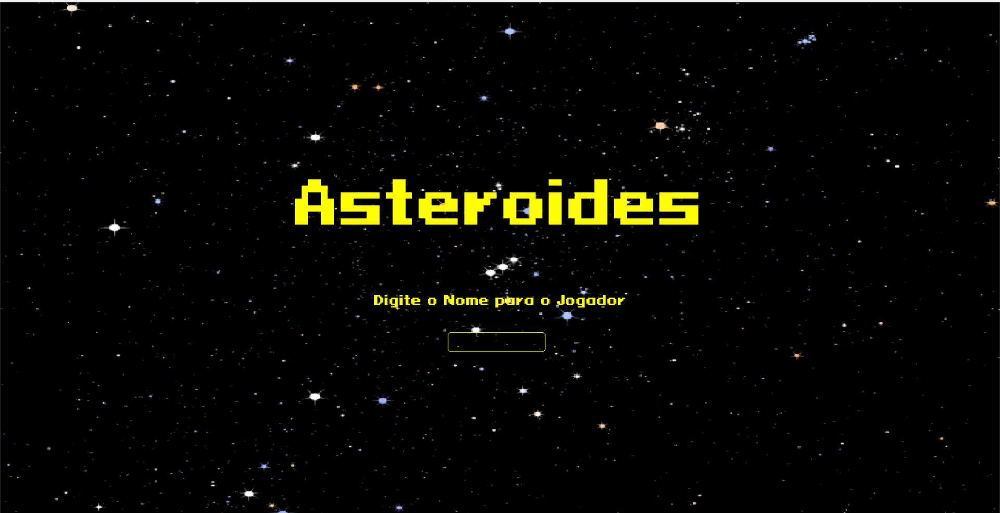
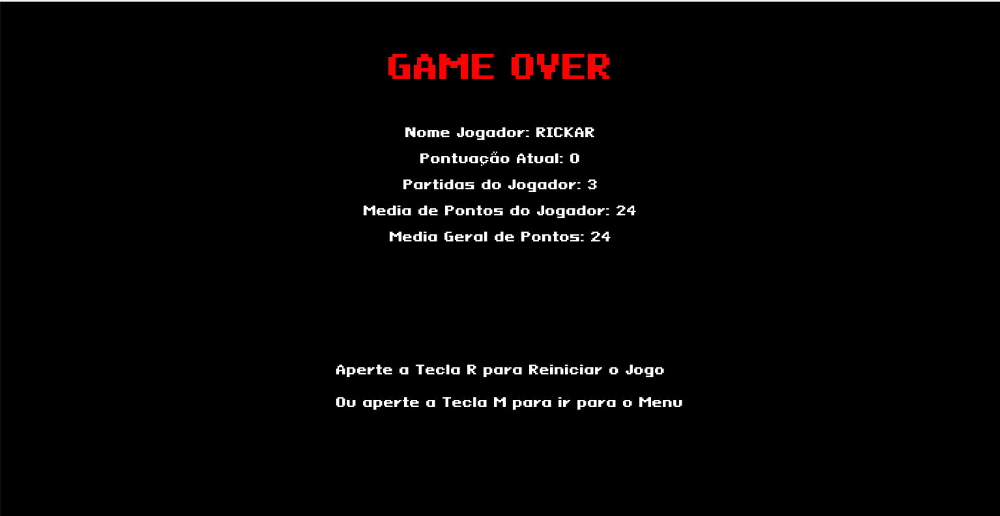

# Asteroides_AVC

Copia do Jogo Asteroides para a AVC de Logica de Programação, usando a linguagem Python e a bliblioteca Pygame
para a criação dos sprites utilizei de uma ferramenta online de criação de sprites em pixel que pode ser usado tanto para criação de imagens
em pixel como para suas animações, usando dos formatos em Gif, Spritesheet etc.

link - [Pisekl](https://www.piskelapp.com/)

## Tela de Menu

## Tela Game Over

